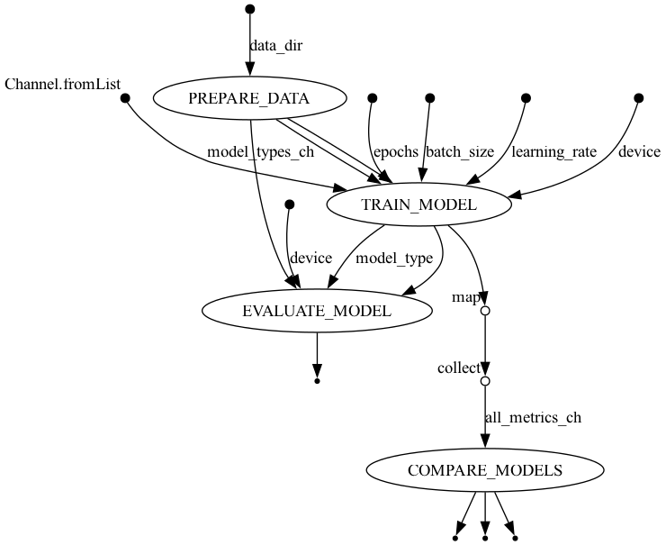

# VisionX AI Marketplace Engine

A pipeline for comparing multiple deep learning model architectures on the MedNIST dataset using Nextflow and MONAI.



## Overview

This project implements a complete pipeline for training and evaluating multiple medical image classification models using the MedNIST dataset. It is structured as a Nextflow workflow to enable parallel model training, scalable execution across different computing environments, and reproducible research.

The pipeline consists of the following stages:
1. **Data Preparation**: Automatic download and preprocessing of the MedNIST dataset
2. **Parallel Model Training**: Simultaneous training of multiple model architectures
3. **Model Evaluation**: Evaluation of each trained model on a test set
4. **Model Comparison**: Analysis of performance metrics across different architectures

## Supported Model Architectures

The pipeline currently supports three neural network architectures:
- **SimpleCNN**: A custom CNN with 3 convolutional layers
- **DenseNet121**: MONAI's implementation of DenseNet
- **ResNet18**: MONAI's implementation of ResNet

## Requirements

- [Nextflow](https://www.nextflow.io/) (21.10.0 or later)
- [Python](https://www.python.org/) (3.8 or later)
- [PyTorch](https://pytorch.org/) (1.9 or later)
- [MONAI](https://monai.io/) (0.9 or later)
- [scikit-learn](https://scikit-learn.org/)
- [matplotlib](https://matplotlib.org/)
- [Docker](https://www.docker.com/) or [Singularity](https://sylabs.io/singularity/) (optional)

## Project Structure

```
nextflow-monai-model-benchmark/
├── main.nf                 # Main Nextflow workflow script
├── nextflow.config         # Nextflow configuration
├── scripts/                # User scripts
│   ├── compare_models.sh   # Script to run model comparison
│   ├── resume_workflow.sh  # Script to resume failed workflows
│   └── run_models.sh       # Script to run specific models
├── bin/                    # Python scripts for each step
│   ├── data.py             # Data preparation and downloading
│   ├── model.py            # Model architecture definitions
│   ├── train.py            # Model training
│   ├── evaluate.py         # Model evaluation
│   └── compare_models.py   # Model comparison analytics
├── modules/                # Nextflow process modules
│   ├── prepare_data.nf     # Data preparation process
│   ├── train_model.nf      # Model training process
│   ├── evaluate_model.nf   # Model evaluation process
│   └── compare_models.nf   # Model comparison process
├── conf/                   # Configuration files
│   ├── base.config         # Base configuration
│   ├── params.config       # Pipeline parameters
│   └── resources.config    # Resource allocation
├── reports/                # Execution reports and visualizations
│   ├── flowchart.png       # Workflow visualization 
│   ├── execution_report.html # Execution summary
│   └── execution_timeline.html # Timeline visualization
└── README.md               # Project documentation
```

## Usage

### 1. Clone this repository:

```bash
git clone https://github.com/yourusername/nextflow-monai-model-benchmark.git
cd nextflow-monai-model-benchmark
```

> **Note**: The pipeline automatically downloads the MedNIST dataset (~167MB) on first run.

### 2. Run the model comparison:

```bash
# Run comparison of all model architectures
./scripts/compare_models.sh
```

This will:
- Download the MedNIST dataset if not present
- Train SimpleCNN, DenseNet, and ResNet models in parallel
- Evaluate all models on the test set
- Generate a comprehensive comparison report

### 3. Resume a failed workflow:

If a workflow fails partway through (e.g., one model fails to train), you can fix the issue and resume:

```bash
# Resume from where the workflow left off
./scripts/resume_workflow.sh
```

### 4. Customize parameters:

You can modify the parameters in `conf/params.config` or pass them directly:

```bash
# Run with custom parameters
nextflow run main.nf \
    --model_types "simple_cnn,densenet" \
    --epochs 10 \
    --outdir custom_results
```

## Key Parameters

| Parameter     | Description                                  | Default                           |
|---------------|----------------------------------------------|-----------------------------------|
| `model_types` | Comma-separated list of models to compare    | `simple_cnn,densenet,resnet`      |
| `data_dir`    | Directory with MedNIST dataset               | `$PWD/data/MedNIST`               |
| `outdir`      | Output directory                             | `$PWD/results_comparison`         |
| `epochs`      | Number of training epochs                    | `1`                               |
| `batch_size`  | Batch size for training                      | `64`                              |
| `device`      | Device to use (cuda/cpu)                     | `cpu`                             |

## Output

Results are saved in the output directory:

- `model/`: Contains subdirectories for each model type with trained weights and metrics
- `evaluation/`: Evaluation results for each model, including:
  - Confusion matrices
  - ROC curves
  - Classification reports
- `comparison/`: Comparison of all models, including:
  - Performance rankings
  - Accuracy comparisons
  - Training time comparisons

## Extending the Pipeline

The pipeline can be extended by:

1. Adding new model architectures in `bin/model.py`
2. Implementing additional data transformations in `bin/data.py`
3. Adding new evaluation metrics in `bin/evaluate.py`
4. Enhancing the comparison analytics in `bin/compare_models.py`

## Acknowledgments

- [MONAI](https://monai.io/) for the medical imaging framework
- [Nextflow](https://www.nextflow.io/) for the workflow management system
- [MedNIST dataset](https://github.com/Project-MONAI/MONAI-extra-test-data) for the medical images
